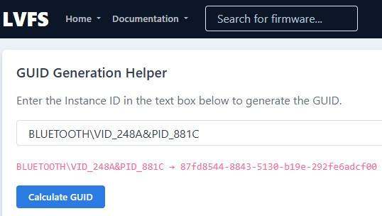
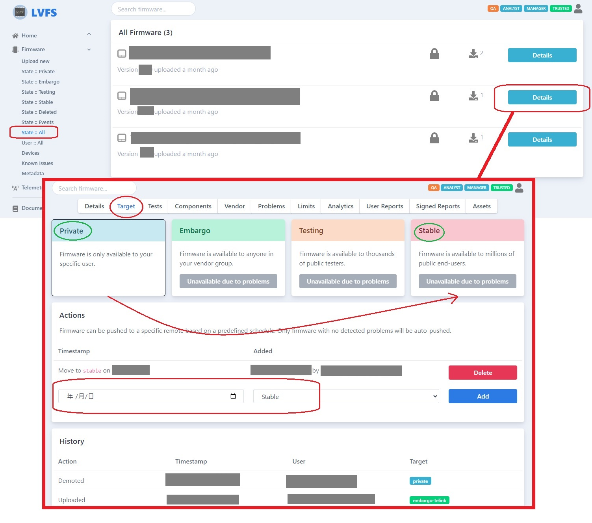

# FWUPD and LVFS User Guide

+ 编程参考
    + [GObject – 2.0](https://docs.gtk.org/gobject/)
    + [fwupd Plugin Tutorial](https://fwupd.github.io/libfwupdplugin/tutorial.html)

## 下载源码

```bash
# get fwupd source code
$ cd ~/work
# offical repo: https://github.com/fwupd/fwupd.git
# forked from official repo: https://github.com/Vitaceae/fwupd
#   use the forked repo which contains the staged Telink plugin
$ git clone git@github.com:Vitaceae/fwupd.git
$ cd fwupd
$ git checkout telink/bluetooth-ota

# get deps(depends on the platform)
$ OS=ubuntu ./contrib/ci/generate_dependencies.py | xargs sudo apt install -y

# setup compile options
$ mkdir build && cd build
# migrate to fwupd v1.9.10:
#   DEPRECATION: Option 'docs' value 'none' is replaced by 'disabled'
#   WARNING: Running the setup command as `meson [options]` instead of `meson setup [options]` is ambiguous and deprecated.
$ meson setup ../ -Dsystemd_root_prefix=/tmp -Dudevdir=/tmp --prefix=$HOME/.root -Ddocs=disabled

# check ninja version
$ ninja -v
```

## 编译安装

```bash
# 移动到目录 fwupd/build
$ sudo ninja install
# 测试插件; 检查装置是否连接
#$ sudo ./src/fwupdtool --plugins telink-dfu get-devices -vv
$ sudo ./src/fwupdtool --plugins telink-dfu get-devices
```

## 建立固件压缩包

+ [LVFS: Uploading Firmware](https://lvfs.readthedocs.io/en/latest/upload.html)
+ Telink 压缩包命名惯例: [vendor]-[device]-[version].cab  
  范例: [telink-8272_dongle-v2.10](inc/telink-8272_dongle-v2.10)  
  范例: [telink-8272_dongle-v2.12](inc/telink-8272_dongle-v2.12)  
    ```text
    telink-8272_dongle-v2.10.cab
    ├── payload.zip
    │   ├── manifest.json
    │   └── firmware.bin
    └── firmware.metainfo.xml
    ```

### 修改 firmware.metainfo.xml

1. 将固件更名为 firmware.bin  
2. 修改 manifest.json(Telink 插件会用到该文件信息)
3. 将 firmware.metainfo.xml 除外的档案打包成 payload.zip  
   ```  
   $ zip -9 payload.zip manifest.json firmware.bin
   ```
4. 计算 payload.zip 校验码  
    ```bash
    $ sha1sum payload.zip
    07b13e75677019163adcb765714990c7456bd108  payload.zip
    
    $ sha256sum payload.zip
    90f49939ffc05b741d51e7dcf03020c548710deaec7907ee29b47501432967b0  payload.zip
    ```
5. 修改 firmware.metainfo.xml 内容 (LVFS 会用到该文件信息)
    + 校验码
    + 版号
    + 产品名
    + [设备匹配 GUID](https://fwupd.org/lvfs/guid)  
      [GUID 说明](https://lvfs.readthedocs.io/en/latest/metainfo.html#using-guids)  
      

### 建立 Cabinet Archive(.cab)

```bash
$ sudo apt install gcab
$ CAB_NAME=telink-8272_dongle-v2.10.cab
$ gcab -c -v $CAB_NAME firmware.metainfo.xml payload.zip

# (debug) 解压 .cab 包(Windows 平台直接用 7-zip 解)
$ sudo apt install cabextract
$ cabextract $CAB_NAME
```

## 固件安装测试

### 从本机

```bash
# 安装 .cab 档案
$ CAB_PATH=~/work/telink-8272_dongle-v2.10.cab
$ sudo ./src/fwupdtool --plugins telink-dfu install $CAB_PATH

# 或安装 payload.zip(不检查metainfo)
$ BLOB_PATH=~/work/payload.zip
$ sudo ./src/fwupdtool --plugins telink-dfu install-blob $CAB_PATH
```

### 从 LVFS

1. 上传固件压缩包至 LVFS
    + [LVFS 上传网址](https://www.fwupd.org/lvfs/upload/firmware)
    + 以公司邮箱注册账号
2. 修正错误; 或手动发布到 stable 通道  
   如果是 private 属性, 需要修正问题才会自动发布到 stable 区, 或者手动发布  
   
3. 安装测试  
   ```bash
   $ sudo ./src/fwupdtool --plugins telink-dfu get-updates
   ```

--------------------------------------------------------------------------------
# 参考教学

[bluez5-spp-example](https://github.com/tonyespy/bluez5-spp-example)  
[Support for BLE devices](https://github.com/fwupd/fwupd/blob/main/docs/tutorial.md#support-for-ble-devices)  
[Linux Vendor Firmware Service](https://www.fwupd.org/)  
  ---> 可搜寻其他厂家已上传的档案做为参考  