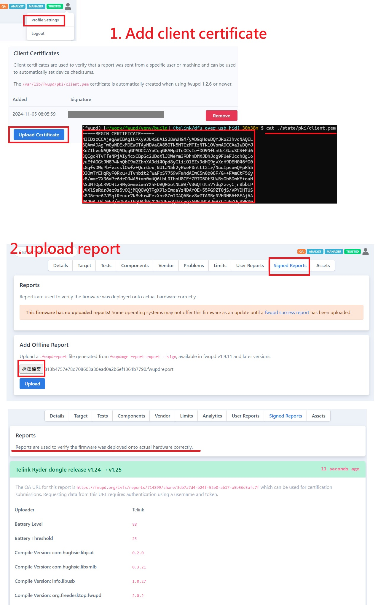
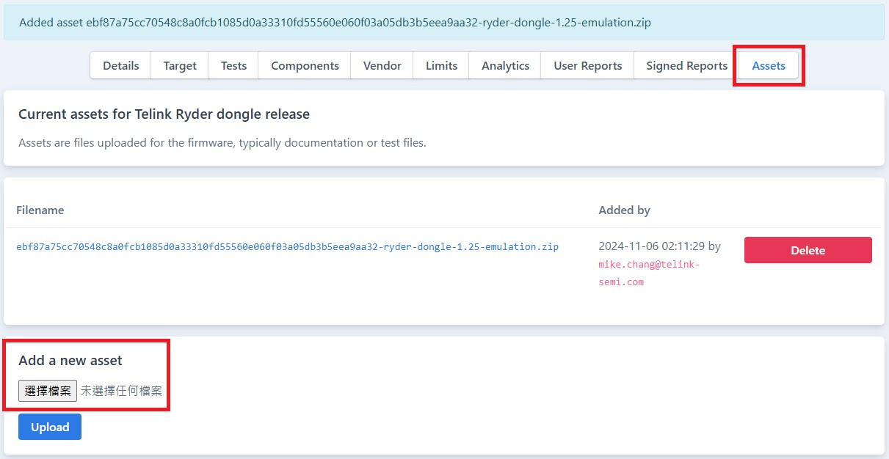

# FWUPD and LVFS User Guide

+ 编程参考
    + [GObject – 2.0](https://docs.gtk.org/gobject/)
    + [fwupd Plugin Tutorial](https://fwupd.github.io/libfwupdplugin/tutorial.html)

## 下载源码

```bash
# get fwupd source code
$ cd ~/work
# offical repo: https://github.com/fwupd/fwupd.git
# forked from official repo: https://github.com/Vitaceae/fwupd
#   use the forked repo which contains the staged Telink plugin
$ git clone git@github.com:Vitaceae/fwupd.git
$ cd fwupd
$ git checkout telink/dfu_over_usb_hid

$ ./contrib/setup

# 建立虚拟开发环境 virtualenv: 编译对象放在 venv/build, 安装路径在 venv/dist
$ source venv/bin/activate

# 测试环境
(fwupd) $ test-fwupd

# 结束测试
(fwupd) $ deactivate
```

## 编译安装

参考源码仓库目录下 docs/building.md

```bash
# 移动到目录 fwupd
$ TOOL_PATH=./venv/build/src

# 建立虚拟开发环境 virtualenv
$ source venv/bin/activate

(fwupd) $ build-fwupd

# 测试插件; 检查装置是否连接
$ sudo $TOOL_PATH/fwupdtool --plugins telink-dfu get-devices -vv

# 结束测试
(fwupd) $ deactivate
```

## 建立固件压缩包

+ [LVFS: Uploading Firmware](https://lvfs.readthedocs.io/en/latest/upload.html)
+ 范例: [ryder-dongle-v1.25.cab](inc/ryder-dongle-v1.25.cab)  
  部分档案为上传后系统自动生成  
    ```text
    xxx.cab
    ├── payload.zip
    │   ├── manifest.json
    │   └── firmware.bin
    └── firmware.metainfo.xml
    ```

### 修改 firmware.metainfo.xml

1. 将固件更名为 firmware.bin  
2. 修改 manifest.json(Telink 插件会用到该文件信息)
3. 将 firmware.metainfo.xml 除外的档案打包成 payload.zip  
   ```  
   $ zip -9 payload.zip manifest.json firmware.bin
   ```
4. 计算 payload.zip 校验码  
    ```bash
    $ sha1sum payload.zip
    07b13e75677019163adcb765714990c7456bd108  payload.zip
    
    $ sha256sum payload.zip
    90f49939ffc05b741d51e7dcf03020c548710deaec7907ee29b47501432967b0  payload.zip
    ```
5. 修改 firmware.metainfo.xml 内容 (LVFS 会用到该文件信息)
    + 校验码
    + 版号
    + 产品名
    + [设备匹配 GUID](https://fwupd.org/lvfs/guid)  
      [GUID 说明](https://lvfs.readthedocs.io/en/latest/metainfo.html#using-guids)  
      

### 建立 Cabinet Archive(.cab)

```bash
$ sudo apt install gcab
# 依实际名称修改
$ CAB_NAME=xxx.cab
$ gcab -c -v $CAB_NAME firmware.metainfo.xml payload.zip

# (debug) 解压 .cab 包(Windows 平台直接用 7-zip 解)
$ sudo apt install cabextract
$ cabextract $CAB_NAME
```

## 固件安装测试

### 从本机

```bash
# 假设当前目录为 fwupd/
$ TOOL_PATH=./venv/build/src
# 依实际路径修改
$ CAB_PATH=~/work/xxx.cab
# 依实际路径修改
$ BLOB_PATH=~/work/payload.zip

# 安装 .cab 档案
$ sudo $TOOL_PATH/fwupdtool --plugins telink-dfu install $CAB_PATH -vv

# 直接安装 payload.zip(不检查metainfo)
$ sudo $TOOL_PATH/fwupdtool --plugins telink-dfu install-blob $CAB_PATH -vv
```

### 从 LVFS

1. 上传固件压缩包至 LVFS
    + [LVFS 上传网址](https://www.fwupd.org/lvfs/upload/firmware)
    + 以公司邮箱注册账号
2. 修正错误; 或手动发布到 stable 通道  
   如果是 private 属性, 需要修正问题才会自动发布到 stable 区, 或者手动发布  
   
3. 需提交测试报告以确保固件无误: [Signed Reports](https://lvfs.readthedocs.io/en/latest/testing.html#signed-reports)

### Offline 提交测试报告

+ 维持两个联线(session), 一个用于运行新版 daemon, 一个用于执行用户命令

Session 1

```bash
# 假设当前目录为 fwupd/
$ source venv/bin/activate
$ cd venv/build

$ cat ./state/pki/client.pem
# 证书要上传到 LVFS(不同的测试机都要上传)
$ sudo ./src/fwupd -vv
```

Session 2

```bash
# 假设当前目录为 fwupd/
$ source venv/bin/activate
$ vi ./venv/bin/../dist/etc/fwupd/fwupd.conf

OnlyTrusted=false

$ cd venv/build
$ CAB_PATH=你的安装包路径
$ sudo ./src/fwupdmgr install $CAB_PATH
$ sudo ./src/fwupdmgr report-export --sign
# 上传 *.fwupdreport 到LVFS
```



### 提交仿真测试(device-emulation)报告

+ [device-emulation](https://github.com/fwupd/fwupd/blob/main/docs/device-emulation.md)

```bash
# 1. Tell the daemon to record a device
# 接入装置, 从 get-device 命令查看 device ID 或 GUID, 准备录制
$ DEV_ID="your id"
#$ DEV_GUID="your guid"
$ ./src/fwupdmgr emulation-tag $DEV_ID
#$ ./src/fwupdmgr emulation-tag $DEV_GUID

# remove and re-insert the device
# 重新插拔装置, 查看信息
$ ./src/fwupdmgr get-devices --filter emulation-tag

# 2. Record data
# 录制 OTA 更新流程
$ CAB_PATH="你的.cab档案路径"
$ EMU_ZIP=emulation-data.zip
$ ./src/fwupdmgr install $CAB_PATH --allow-reinstall
$ ./src/fwupdmgr emulation-save $EMU_ZIP

# 3. Test your data
# 移除装置, 仿真 OTA 更新流程(非必要?)
$ ./src/fwupdmgr emulation-load $EMU_ZIP
$ ./src/fwupdmgr get-devices --filter emulated
$ ./src/fwupdmgr install $CAB_PATH --allow-reinstall
```

提交固件仿真数据  


**其他问题**

>   Could not check for auth: GDBus.Error:org.freedesktop.PolicyKit1.Error.Failed: Action org.freedesktop.fwupd.emulation-save is not registered

```bash
$ sudo apt-get install policykit-1
# 将 org.freedesktop.fwupd.policy 复制到 /usr/share/polkit-1/actions/
```

>   (仿真 OTA 更新流程)
>   Writing…
>   failed to write-firmware: failed to SetReport [interrupt-transfer]: no event with ID InterruptTransfer:Endpoint=0x05,Data=...

暂不处理

--------------------------------------------------------------------------------
# 参考教学

[bluez5-spp-example](https://github.com/tonyespy/bluez5-spp-example)  
[Support for BLE devices](https://github.com/fwupd/fwupd/blob/main/docs/tutorial.md#support-for-ble-devices)  
[Linux Vendor Firmware Service](https://www.fwupd.org/)  
  ---> 可搜寻其他厂家已上传的档案做为参考  